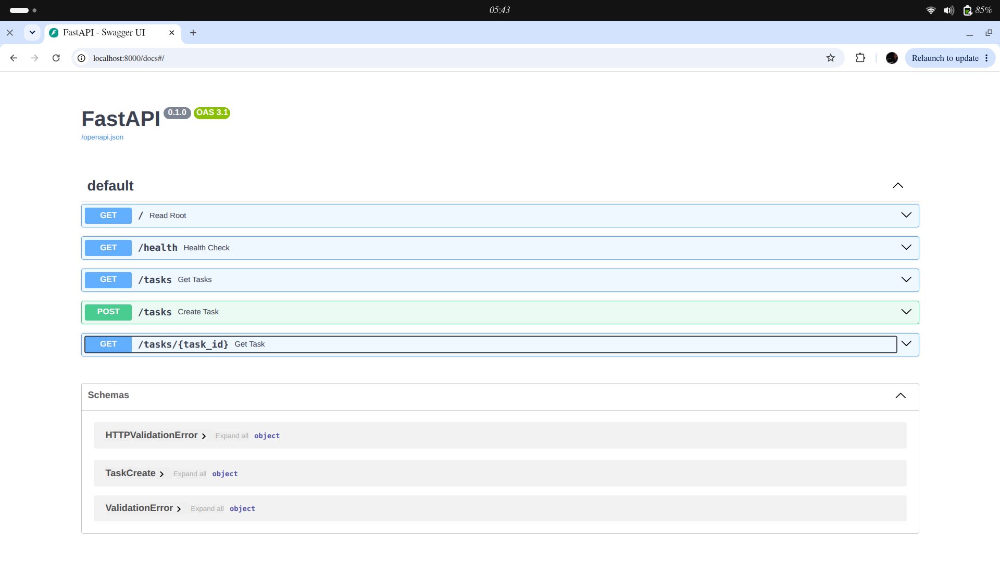
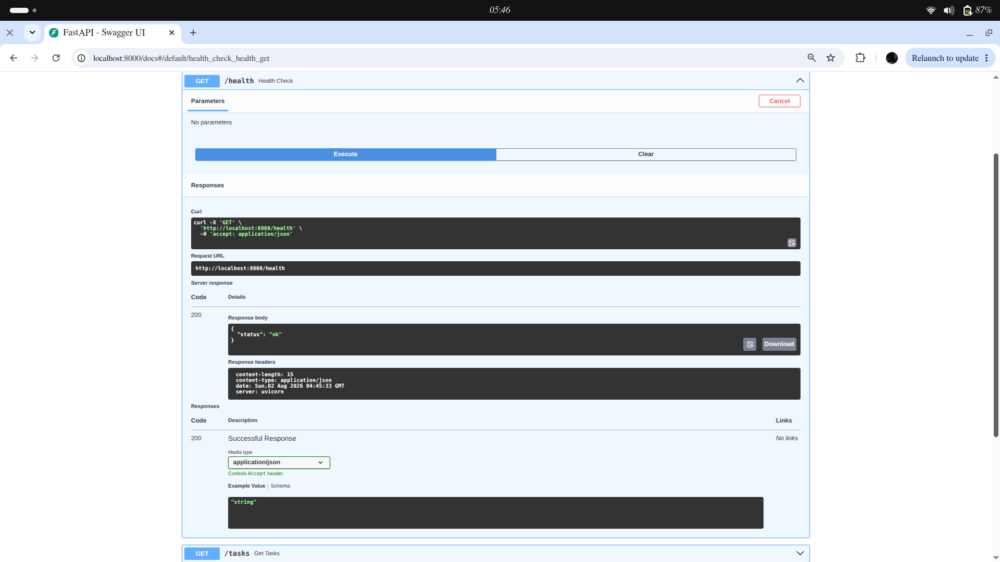

# Flyrank Task API

A FastAPI-based application built through sequential development stages.

## Project Stages
* **Stage 1**: Hello Server setup
* **Stage 2**: Root endpoint configuration
* **Stage 3**: Core API logic and request handling
* **Stage 4**: Final structure, validation, and documentation

## API Screenshot

